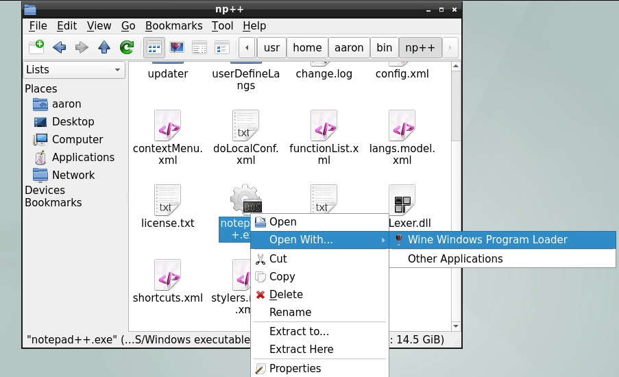

# 13.4.在 FreeBSD 上运行第一个 WINE 程序

现在 WINE 已经安装好了，下一步是通过运行一个简单的程序来试试。简单的方法是下载一个独立的应用程序，也就是说，可以简单地解压和运行程序而无需任何复杂的安装过程。

所谓的“可移植”版本的应用程序是这种测试的好选择，只用一个可执行文件运行的程序也是如此。

## 13.4.1.从命令行运行一个程序

有两种不同的方法可以从终端启动一个 Windows 程序。第一种，也是最直接的一种，是导航到包含程序可执行文件（**.EXE**）的目录，然后执行以下命令：

```shell-sessionl
% wine program.exe
```

对于需要命令行参数的应用程序，像往常一样在可执行文件后添加参数：

```shell-sessionl
% wine program2.exe -file file.txt
```

另外，提供可执行文件的完整路径，以便在脚本中使用它，例如：

```shell-sessionl
% wine /home/user/bin/program.exe
```

## 13.4.2.使用 GUI 运行一个程序

安装后，图形 shell 应更新为与 Windows 可执行文件（**.EXE**）有关的新关联。现在可以使用文件管理器浏览系统，并以与其他文件和程序相同的方式启动 Windows 应用程序（单击或双击，取决于桌面的设置）。

在大多数桌面上，通过右键点击文件，并在上下文菜单中寻找打开文件的条目，来检查确保这种关联是正确的。其中一个选项（希望是默认选项）将是与 **Wine Windows 程序加载器**，如下面的截图所示：



如果程序不能按预期运行，请尝试从命令行启动它，并查看终端显示的所有信息以排除故障。

如果 WINE 在安装后不是 **.EXE** 文件的默认应用程序，请检查当前桌面环境、图形化 shell 或文件管理器中该扩展名的 MIME 关联。
