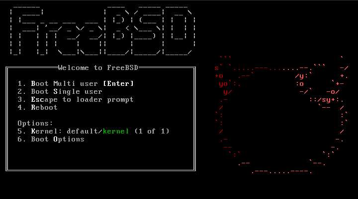
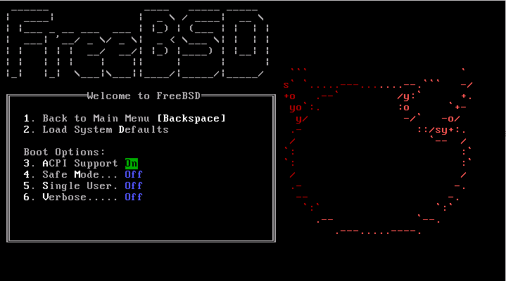

# 2.4. 开始安装

> **重要：**
>
> 在默认情况下，出现以下信息之前，安装程序不会对磁盘进行任何修改。
>
> ```
> Your changes will now be written to disk. If you have chosen to overwrite existing data, it will be PERMANENTLY ERASED. Are you sure you want to commit your changes?
>```
>
> 在此之前均可安全退出。如果担心有什么地方配置不正确，只要在这之前关闭计算机，系统的磁盘就不会有任何变化。

本节介绍了如何从安装介质启动系统，安装介质是按照[准备安装介质](https://docs.freebsd.org/en/books/handbook/bsdinstall/#bsdinstall-installation-media) 指引准备好的。当使用可启动系统的 U 盘时，在打开计算机之前先插入 U 盘。当从 CD 或 DVD 光盘启动时，请在启动计算机后立即放入光盘。不同架构系统下如何设置系统从插入的介质启动会有所不同。

## 2.4.1.在 i386™ 和 amd64 上启动

这些架构提供了一个 BIOS 菜单来选择启动设备。根据所使用的安装介质，选择 CD/DVD 或 USB 设备作为第一启动设备。大多数系统还提供了一组键盘快捷键用于在启动过程中选择启动设备，而不需要进入 BIOS。一般来说，这个快捷键是 `F10`、`F11`、`F12` 或 `Escape`。

如果计算机加载的是现有的操作系统而不是 FreeBSD 的安装程序，可能由于：

  1. 安装介质在启动过程中放入太晚。不必拿出介质并尝试重新启动计算机。

  2. BIOS 更改不正确或没有保存。仔细检查是否选择了正确的启动设备作为首选启动设备。

  3. 这个系统太老了，不支持从所选介质启动。在这种情况下，可以使用 Plop Boot Manager（<http://www.plop.at/en/bootmanagers.html> ）从选定的介质启动系统。

## 2.4.2.在 PowerPC® 上启动

在大多数机器上，在启动过程中按住键盘上的 `C` 将从 CD 启动。或者按住 `Command` + `Option`+ `O` + `F`，又或者在非苹果®键盘上按住 `Windows` + `Alt` +`O`+ `F`。在 `0>` 提示下符下，输入：

```
 boot cd:,\ppc\loader cd:0
```

## 2.4.3.FreeBSD 启动目录

系统从安装介质启动以后，将显示一个类似于下图的菜单：



***图 1. FreeBSD 启动引导菜单***

在默认情况下，启动到 FreeBSD 安装程序之前，该菜单会等待 10 秒钟让用户输入；如果已经安装过 FreeBSD，则会出现在启动 FreeBSD 之前。按 `space` 键来暂停启动计时器以查看选择。要选择某个选项，按菜单条目对应的高亮数字、字符或键。以下是可选菜单条目：

- `Boot Multi User:` 多用户模式。这将继续 FreeBSD 的启动过程。如果启动计时器已经暂停，按 `1`，大写或小写的 `B`，或 `Enter` 键继续。

- `Boot Single User:` 单用户模式。这个模式可以用来修复现有的 FreeBSD 安装，如 ["Single-User Mode"](https://docs.freebsd.org/en/books/handbook/boot/index.html#boot-singleuser) 中所述。按 `2` 或大写或小写的 `S` 来进入这个模式。

- `Escape to loader prompt:` 切换至引导提示符。这将引导系统进入一个包含有限数量底层命令的修复提示。这个提示将在 [“Stage Three”](https://docs.freebsd.org/en/books/handbook/boot/index.html#boot-loader) 中描述。按`3`或`Esc`键启动进入这个提示。

- `Reboot:` 重启系统。

- `Kernel:` 内核。加载一个不同的内核。

- `Configure Boot Options:` 配置启动参数。打开“FreeBSD Boot Options Menu”中描述的菜单。



***图 2. FreeBSD 开机选项菜单***

开机选项菜单分为两个部分。第一部分可以用来返回到主启动菜单或将任何已切换的选项重新设置为默认值。

下一个部分是用来切换可用的选项，通过按下选项的高亮数字或字符来开启或关闭。系统将始终使用这些选项的设置启动，直到它们被修改。有几个选项可以通过这个菜单进行切换：

- ACPI Support: ACPI 支持。如果系统在启动过程中挂起，请尝试将该选项切换为`off`。

- Safe Mode: 安全模式。如果即使将 ACPI 支持设置为`off`，系统在启动时仍然挂起，请尝试将这个选项设置为 `on`。

- Single User: 单用户模式。将这个选项切换到`On`来修复现有的 FreeBSD 安装，如`Single-User Mode`中所述。如果问题得到解决了，再将其设置为 `off` 即可。

- Verbose: 啰嗦模式。把这个选项切换到`On`，可以在启动过程中看到更详细的信息。这在排除某个硬件的故障时可能很有用。

在做出必要的选择后，按`1`或`Backspace`键返回主启动菜单，然后按`Enter`键继续启动 FreeBSD。当 FreeBSD 进行硬件设备探测并加载安装程序时，会出现一系列的启动信息。启动完成以后，将显示欢迎菜单。


***图 3. 欢迎菜单***

按回车键，选择默认的 `Install`，进入安装程序。本章的其余部分将介绍如何使用这个安装程序。另外，可使用左右箭头或彩色字母来选择所需的菜单项。`Shell`可以用来访问一个 FreeBSD shell，以便在安装前使用命令行工具来准备磁盘。`Live CD` 选项可以用来在安装前试用 FreeBSD。实况版本在使用 Live CD 中有描述。

>**技巧：**
>
>要查看开机信息，包括硬件设备探测，按大写或小写的`S`，然后按回车键进入一个 shell。在 shell 提示符下，输入`more /var/run/dmesg.boot`，并使用空格键滚动浏览信息。完成后，键入`exit`来返回欢迎菜单。
