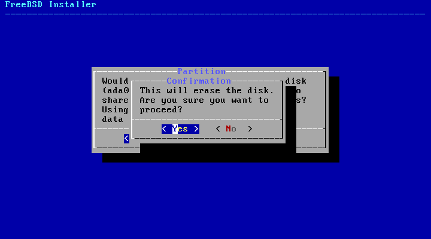
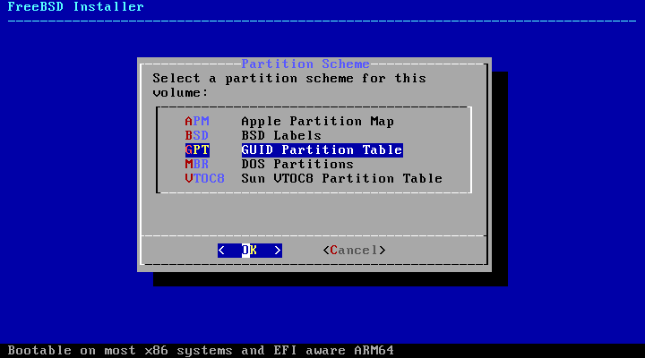
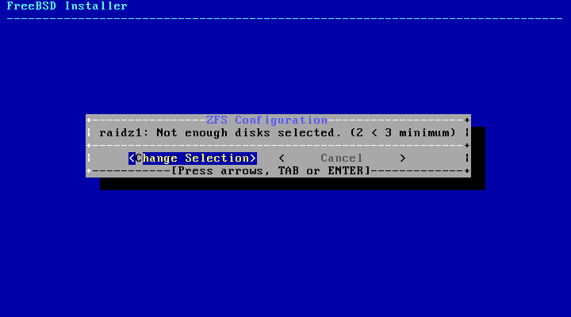
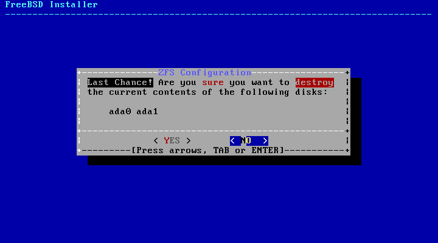

# 2.6.分配磁盘空间

接下来的菜单可用来选择分配磁盘空间的方案。

_**图 10. 分区选择**_

bsdinstall 为用户提供了四种分配磁盘空间的方案：

- `Auto (ZFS)` 分区将创建一个使用 ZFS 作为根分区的系统，并为 _引导环境_ 提供可选的 GELI 加密支持。
- `Auto (UFS)` 分区将使用 `UFS` 文件系统自动设置磁盘分区。
- `Manual` 分区允许专业用户通过菜单选项创建自定义分区。
- `Shell` 将打开 shell 提示符，专业用户可以使用 [gpart(8)](https://www.freebsd.org/cgi/man.cgi?query=gpart&sektion=8&format=html)、[fdisk(8)](https://www.freebsd.org/cgi/man.cgi?query=fdisk&sektion=8&format=html) 和 [bsdlabel(8)](https://www.freebsd.org/cgi/man.cgi?query=bsdlabel&sektion=8&format=html) 等命令行工具创建自定义分区。

本节列出了在分配磁盘分区时需要考虑的问题，并演示了不同分区的使用方法。

## 2.6.1.设计分区布局

文件系统的默认分区布局是整个系统使用一个文件系统。当使用 `UFS` 时，如果你有足够的磁盘空间或多个磁盘，可能值得考虑使用多个文件系统。在布局文件系统时，请记住，硬盘的外部轨道较内部轨道传输数据的速度快。因此，零碎和经常读写的文件系统应该靠近硬盘的外部，而较大的分区，如 **/usr** 应该放在磁盘的内部。推荐以类似的顺序创建分区：**/**、**swap**、**/var** 然后是 **/usr**。

**/var** 分区的大小反映了机器的用途。这个分区用来存放邮件、日志文件和打印后台处理程序。邮件和日志文件可以增长到意想不到的大小，这取决于用户数量和日志文件的保存时间。一般来说，大多数用户的 **/var** 很少会占用超过 1GB 的可用磁盘空间。

> **注意**
>
> 有时，**/var/tmp** 需要大量的磁盘空间。当安装新软件时，打包工具会在 **/var/tmp** 下提取软件包的临时存档。如果 **/var/tmp** 下没有足够的磁盘空间，大型软件包（如 Firefox 或 LibreOffice）的安装可能会很麻烦。

**/usr** 分区存放着许多支持系统的文件，包括 FreeBSD ports 和系统源代码。这个分区建议至少要有 2GB 的空间。另外，请注意，用户的主目录默认放在 `/usr/home` 中，但也可以放在其他分区上。在默认情况下，`/home` 是指向 `/usr/home` 的符号链接。

在选择分区大小的时候，要牢记空间需求。一个分区的空间用完了，而另一个分区却几乎用不完，这可能是个麻烦事。

根据经验，交换空间应该是物理内存（RAM）的两倍（(对于较大的内存配置来说，可以不到两倍）。拥有较小内存的系统可能会因为有更多的交换空间而表现得更好。配置过小的交换空间会导致虚拟内存页面管理效率低下，如果以后添加更多的内存，可能会产生问题。

在具有多个 SCSI 磁盘或在不同控制器上运行的多个 IDE 磁盘的大型设备上，建议在每个磁盘上都配置交换空间，最多可为四个磁盘配置。交换分区的大小应该大致相同。虽然内核可以处理任意大小的交换空间，但是当内部数据结构扩展到最大交换分区的 4 倍时，保持交换分区接近相同的大小将可让内核以最佳方式在不同的磁盘上串联交换空间。大的交换空间可能会引起内核对总配置的交换空间数量的警告信息。按照警告信息的指示，可通过增加允许用于跟踪交换分配的内存量来提高限制。在被迫重启之前，可能更容易从失控的程序中恢复。

通过对系统进行适当的分区，在零碎文件写入量大的分区中引入的碎片将不会干扰频繁读取的分区。让写入量大的分区更接近磁盘的边缘，可提高频繁写入分区的 I/O 性能。虽然可能较大的分区也需要提升 I/O 性能，但将它们移向磁盘边缘不会比将 **/var** 移向磁盘边缘带来的性能改善那么明显。

## 2.6.2.使用 UFS 进行向导式分区

当选择这种方法时，菜单将显示可用的磁盘。如果使用了多个磁盘，请选择要将 FreeBSD 安装到哪个磁盘。

_**图 11. 从多个磁盘中选取**_

选择了磁盘以后，接下来的菜单就会提示安装到整块磁盘或利用可用空间创建一个分区。如果选择 **Entire Disk**，将自动创建一个使用整个磁盘的通用分区布局。选择 **Partition** 则用磁盘上未使用的空间创建一个分区布局。

_**图 12. 选择整块硬盘或分区**_

在选择了 **Entire Disk** 之后，bsdinstall 会显示一个对话框，表明磁盘所有内容将被删除。

_**图 13. 确认**_

接下来的菜单显示了可用分区表的列表。GPT 通常是最合适 amd64 计算机的选择。与 GPT 不兼容的老式计算机应该使用 MBR。其他分区表一般用于不常见的或较老的计算机。更多信息可在[分区表](https://docs.freebsd.org/en/books/handbook/bsdinstall/#partition-schemes)中找到。

_**图 14. 选择分区表**_

在创建了分区布局之后，请检查它以确保其符合安装的需要。选择 **Revert** 可以将分区重置为初始值，按 **Auto** 可以重新自动创建 FreeBSD 分区。也可以手动创建、修改或删除分区。当确认分区后，选择 **Finish** 来继续安装。

_**图 15. 检查创建的分区**_

磁盘被配置好之后，接下来的菜单提供了一个在选定的磁盘被格式化之前进行最后修改的机会。。如果需要进行修改，请选择 **Back**，返回到主分区菜单。**Revert & Exit** 将退出安装程序，不对磁盘做任何改变。此外，选择 **Commit**，开始进行安装过程。

_**图 16. 结束确认**_

要继续安装过程，请进入[获取安装文件](https://docs.freebsd.org/en/books/handbook/bsdinstall/#bsdinstall-fetching-distribution)。

## 2.6.3.手动分区

手动分区将直接使用分区编辑器进行操作：

_**图 17. 手动创建分区**_

突出显示安装磁盘（本例中为 **ada0**），并选择 **Create** 以显示可用分区表的菜单。

_**图 18. 手动创建分区**_

GPT 通常是 amd64 电脑的最合适选择。与 GPT 不兼容的老式计算机应该使用 MBR。其他分区表一般用于不常见的或较老的计算机。

**表格 1.分区表**

| 缩写 |                                       说明                                       |
| :--: | :------------------------------------------------------------------------------: |
| APM  |                           PowerPC® 使用的 Apple 分区表                           |
| BSD  | 无 MBR 的 BSD 标签，有时也称作 _危险专用模式_，因为非 BSD 磁盘工具可能无法识别它 |
| GPT  |       ([ GUID 分区表](http://en.wikipedia.org/wiki/GUID_Partition_Table))        |
| MBR  |         ([主引导记录](http://en.wikipedia.org/wiki/Master_boot_record))          |

选择并创建了分区表后，再次选择 **Create** 来创建分区。`Tab` 键用于在各选项之间移动光标。

_**图 19. 手动创建分区**_

无论使用 ufs 还是 zfs，标准的 FreeBSD GPT 安装都至少要使用三个分区：

- `freebsd-boot` 或 `efi`——存放 FreeBSD 的引导代码。
- `freebsd-ufs`——FreeBSD UFS 文件系统。
- `freebsd-zfs`——FreeBSD ZFS 文件系统。关于 ZFS 的更多信息可以在 [Z 文件系统（ZFS）](https://docs.freebsd.org/en/books/handbook/zfs/index.html#zfs)中找到。
- `freebsd-swap`——FreeBSD 交换空间。

关于可用的 GPT 分区类型的说明，请参考 [gpart(8)](https://www.freebsd.org/cgi/man.cgi?query=gpart&sektion=8&format=html)。

可创建多个文件系统分区，有些人可能偏好采用传统的布局，为 **/**、**/var**、**/tmp** 和 **/usr** 分开分区。请看[创建传统分割文件系统分区的例子](https://docs.freebsd.org/en/books/handbook/bsdinstall/#bsdinstall-part-manual-splitfs)。

> **技巧**
>
> 注意，在有足够内存的系统上，`/tmp` 可以在以后作为一个基于内存的文件系统（[tmpfs(5)](https://www.freebsd.org/cgi/man.cgi?query=tmpfs&sektion=5&format=html)）而添加。

可以用常见的缩写来输入 `Size`：_K_ 代表 KB，_M_ 代表 MB，_G_ 代表 GB。

> **技巧**
>
> 正确的扇区对齐才能提供最好的性能，使分区大小为 4K 字节的偶数倍有助于确保在具有 512 字节或 4K 字节扇区的设备上对齐。一般来说，使用 1M 或 1G 的偶数倍的分区大小是确保每个分区从 4K 的偶数倍开始的最简单方法。有一个例外：由于目前引导代码的限制，_freebsd-boot_ 分区不应大于 512K。

如果该分区将包含文件系统，则需要一个`Mountpoint`（挂载点）。如果只创建了一个 UFS 分区，挂载点应该是 **/**。

`Label`（标签）是一个分区的名称，人们将通过它来了解该分区。如果硬盘被连接到不同的控制器或端口，磁盘的名称或编号可能有所不同，但分区的标签不会改变。如在 **/etc/fstab** 等文件中使用标签而不是磁盘名称和分区号，可使系统在硬件变化时有更大的兼容性。GPT 标签在连接磁盘时会显示在 **/dev/gpt/**。其他分区表的标签的功能各不相同，它们的标签显示在 **/dev/** 的各自目录中。

> **技巧**
>
> 每个分区上的标签应是独一无二的，以避免相同的标签产生冲突。可以将计算机名称、用途或位置中的几个字母添加到标签中。例如，在名为 `lab` 的计算机上使用 `labroot` 或 `rootfslab` 作为 UFS root 分区的标签。

> **例 1.创建传统的分离式文件系统分区**
>
> 对于传统的分区布局而言，即 **/**、**/var**、**/tmp** 和 **/usr** 目录在各自的分区上是一个独立的文件系统。对于一块 20G 大小磁盘而言，首先创建一个 GPT 分区表，然后按图所示创建分区。如果目标磁盘上有更多的空间，则增加交换分区和 **/var** 分区的大小比较有用。这里显示的标签以 `ex` 为前缀，表示“example”（示例），读者应该结合上文使用其他独一无二的标签。
>
> 默认情况下，FreeBSD 的 **gptboot** 认为第一个 UFS 分区是 **/** 分区。

|   分区类型   |               大小               |  挂载点  |   标签   |
| :----------: | :------------------------------: | :------: | :------: |
| freebsd-boot |               512K               |          |          |
| freebsd-ufs  |                2G                |  **/**   | exrootfs |
| freebsd-swap |                4G                |          |  exswap  |
| freebsd-ufs  |                2G                | **/var** | exvarfs  |
| freebsd-ufs  |                1G                | **/tmp** | extmpfs  |
| freebsd-ufs  | 采取默认值（使用磁盘的剩余部分） | **/usr** | exusrfs  |

自定义分区创建完毕后，选择 **Finish** 继续安装，并进入[获取安装文件](https://docs.freebsd.org/en/books/handbook/bsdinstall/#bsdinstall-fetching-distribution)。

## 2.6.4.使用 Root-on-ZFS 进行向导式分区

这种分区模式只能使用整个磁盘，并且会擦除整个磁盘的内容。ZFS 的主配置菜单提供了许多选项来控制池的创建。

_**图 20. ZFS 分区菜单**_

下面是这个菜单中选项的摘要介绍：

- `Install`——使用选定的选项继续安装。
- `Pool Type/Disks`——配置 `Pool Type` 和构成池的磁盘。，除了在条带模式下，ZFS 自动安装程序目前只支持创建单一顶层的`vdev`。要创建更复杂的池，请通过 [Shell 分区模式](https://docs.freebsd.org/en/books/handbook/bsdinstall/#bsdinstall-part-shell)中的说明来创建池。
- `Rescan Devices`——重新加载可用磁盘的列表。
- `Disk Info`——该菜单可以用来检查每个磁盘，包括它的分区表和其他各种信息，如设备型号和序列号（如果有）。
- `Pool Name`——新建池的名称。默认名称是 _zroot_。
- `Force 4K Sectors?`——强制使用 4K 扇区。默认情况下，安装程序会自动创建与 4K 边界对齐的分区并强制 ZFS 使用 4K 扇区。这在 512 字节扇区的磁盘上也是安全的，而且还有一个额外的好处，那就是确保在 512 字节磁盘上创建的池将来可以添加 4K 扇区的磁盘，以作为额外的存储空间或替换故障磁盘。按`回车键`以选择是否激活它。
- `Encrypt Disks?`——加密磁盘允许用户使用 GELI 对磁盘进行加密。更多关于磁盘加密的信息可以在[使用 geli 进行磁盘加密](https://docs.freebsd.org/en/books/handbook/disks/index.html#disks-encrypting-geli)中找到。按`回车键`，选择是否激活它。
- `Partition Scheme`——选择分区表。在大多数情况下推荐 GPT。按`回车键`在不同的选项中进行选择。
- `Swap Size`——建立交换空间的大小。
- `Mirror Swap?`——是否在磁盘之间做镜像交换。请注意，启用镜像交换将破坏崩溃转储。按`回车键`来激活或不激活该选项。
- `Encrypt Swap?`——是否对交换分区进行加密。这将在每次系统启动时用一个临时密钥对交换分区进行加密，并在重启时丢弃。按`回车键`可以选择是否激活它。在[加密 Swap](https://docs.freebsd.org/en/books/handbook/disks/index.html#swap-encrypting) 中有更多关于加密交换分区的信息。

选择 `T` 来配置 `Pool Type` 和构成池的磁盘。

_**图 21. ZFS 池类型**_

下面是在这个菜单中可以选择的 `Pool Type` 的摘要：

- `stripe`——条带提供所有连接设备相加的最大存储量，但没有冗余。如果任何一个磁盘发生故障，池中的数据将不可逆地丢失。
- `mirror`——镜像在每个磁盘上存储所有数据的一个完整备份。镜像提供了良好的读取性能，因为数据是从所有磁盘上平行读取的。写入性能较慢，因为数据必须写到池中的所有磁盘上。可允许除一个磁盘外的所有磁盘发生故障。这个选项至少需要两个磁盘。
- `raid10`——镜像阵列条带。提供最好的性能，但存储量最少。这个选项需要偶数个硬盘，且至少需要四个硬盘。
- `raidz1`——单一冗余 RAID。可允许一个磁盘同时发生故障。该选项至少需要 3 个磁盘。
- `raidz2`——双重冗余 RAID。可允许两个磁盘同时发生故障。该选项至少需要 4 个磁盘。
- `raidz3`——三重冗余 RAID。可允许三个磁盘同时发生故障。该选项至少需要 5 个磁盘。

选择了 `Pool Type` 之后，就会显示可用的磁盘列表，并提示用户选择一个或多个磁盘来组成池。然后，配置会被验证，以确保有足够的磁盘被选中。如果验证失败，选择 **\<Change Selection>** 回到磁盘列表，或者 **\<Back>** 改变 `Pool Type`。

_**图 22. 磁盘选择**_

_**图 23. 无效的选择**_

如果列表中缺少一个或多个磁盘，或者磁盘是在安装程序启动后连接的，请选择 **- Rescan Devices** 设备来重新加载可用磁盘的列表。

_**图 24. 重新扫描设备**_

为了避免意外地擦除错误的磁盘，**- Disk Info** 菜单可以用来检查每个磁盘，包括其分区表和其他各种信息，如设备型号和序列号（如果有的话）。

_**图 25. 磁盘分析**_

选择 `N` 可配置 `Pool Name`。输入所需的名称，然后选择 **\<OK>** 创建它，或 **\<Cancel>** 返回主菜单并保留默认名称。

_**图 26. Pool Name**_

选择 `S` 来设置交换分区大小。输入所需的交换分区容量，然后选择 **\<OK>** 建立，或选择 **\<Cancel>** 返回主菜单，让其使用默认值。

_**图 27. 交换分区大小**_

所有的选项都被设置为所需的值之后，选择菜单顶部的 **>>> Install**。然后安装程序提供了一个最后确认的机会，在所选磁盘的内容被销毁以创建 ZFS 池之前，可以取消。

_**图 28. 最后确认**_

如果启用了 GELI 磁盘加密，安装程序将提示输入用于加密磁盘的口令两次。而后开始进行加密的初始化。

_**图 29. 磁盘加密密码**_

_**图 30. 初始化加密**_

然后安装会正常进行。要继续安装，请进入[获取安装文件](https://docs.freebsd.org/en/books/handbook/bsdinstall/#bsdinstall-fetching-distribution)。

## 2.6.5.SHELL 分区模式

在创建高级安装时，bsdinstall 的分区菜单可能无法提供所需的灵活度。专业用户可以从分区菜单中选择 **Shell** 选项，以便手动对磁盘进行分区，创建文件系统，填写 **/tmp/bsdinstall_etc/fstab**，并在 **/mnt** 下加载文件系统。完成后，键入`exit`，返回 bsdinstall，继续安装。