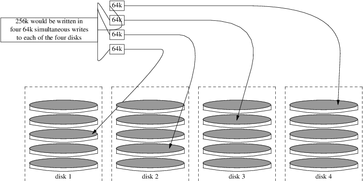

# 20.2.RAID0——条带

条带化将几个磁盘驱动器组合成一个卷。可以通过使用硬件 RAID 控制器来进行条带化。GEOM 磁盘子系统为磁盘条带化提供软件支持，也称为 RAID0，不需要 RAID 磁盘控制器。

在 RAID0 中，数据被分割成多个块，被分别写入阵列中的所有磁盘。如下图所示，RAID0 不需要等待系统向一个磁盘写入 256k 的数据，而是可以同时向阵列中的四个磁盘各写入 64k 的数据，从而提供卓越的 I/O 性能。这种性能可以通过使用多个磁盘控制器进一步增强。




RAID0 条带中的每个磁盘必须具有相同的大小，因为 I/O 请求是交错进行的，以并行地读或写到多个磁盘。

> **注意**
>
> RAID0 不提供任何冗余。这意味着，如果阵列中的一个磁盘发生故障，磁盘上的所有数据都会丢失。如果数据很重要，请实施一个备份策略，定期将备份保存到远程系统或设备上。

在 FreeBSD 系统上使用商用磁盘创建一个基于 GEOM 的软件 RAID0 的过程如下。如果创建了条带，请参考 [gstripe(8)](https://www.freebsd.org/cgi/man.cgi?query=gstripe&sektion=8&format=html) 以了解更多关于如何控制现有条带的信息。

> **创建未格式化的 ATA 磁盘条带的步骤**
>
> 1. 加载 **geom\_stripe.ko** 模块：
>
> ```
> # kldload geom_stripe
> ```
>
> 2. 确保存在一个合适的挂载点。如果这个卷将成为根分区，那么暂时使用另一个挂载点，如 **/mnt**
> 
> 3. 确定要条带化的磁盘的设备名称，并创建新的条带设备。例如，要对两个未使用和未分区的 ATA 磁盘进行条带化，设备名称为 **/dev/ad2** 和 **/dev/ad3**：
>
> ```
> # gstripe label -v st0 /dev/ad2 /dev/ad3
> Metadata value stored on /dev/ad2.
> Metadata value stored on /dev/ad3.
> Done.
> ```
>
> 4. 在新卷上写一个标准标签，也称为分区表，并安装默认的引导代码：
>
> ```
> # bsdlabel -wB /dev/stripe/st0
> ```
>
> 5. 这个过程应该在 **/dev/stripe** 中创建除 **st0** 之外的另外两个设备。这些设备包括 **st0a** 和 **st0c**。此时，可以使用 `newfs` 在 **st0a** 上创建一个 UFS 文件系统：
>
> ```
> # newfs -U /dev/stripe/st0a
> ```
>
> 在屏幕上会滑过许多数字，几秒钟后，这个过程就完成了。卷已经被创建，并准备好被挂载。
> 
> 6. 要手动挂载创建的磁盘条带：
>
> ```
> # mount /dev/stripe/st0a /mnt
> ```
>
> 7. 为了在启动过程中自动挂载这个带状文件系统，把卷的信息放在 **/etc/fstab** 中。在这个例子中，创建了一个永久的挂载点，名为 **stripe**：
>
> ```
> # mkdir /stripe
> # echo "/dev/stripe/st0a /stripe ufs rw 2 2" \
> >> /etc/fstab
> ```
>
> 8. **geom\_stripe.ko** 模块也必须在系统初始化时自动加载，方法是在 **/boot/loader.conf** 中添加一行：
>
> ```
> # echo 'geom_stripe_load="YES"' >> /boot/loader.conf
> ```
